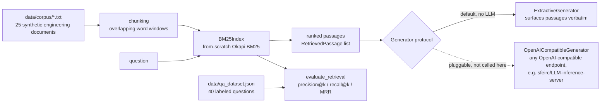

# Engineering-Docs-RAG

A from-scratch **BM25 retrieval** pipeline for engineering documents (equipment datasheets, safety procedures, HAZOP excerpts) -- with a **pluggable answer-generation interface** that defaults to a deterministic, no-LLM extractive backend, and never makes a paid LLM API call anywhere in its tests, CI, or demo.

[](https://github.com/sfeirc/Engineering-Docs-RAG/actions/workflows/ci.yml)


[](LICENSE)

## Why this exists

Large industrial operators -- Saudi Aramco among them -- maintain enormous libraries of technical documents: equipment datasheets, safety procedures, HAZOP (Hazard and Operability) study reports, inspection records. A field engineer trying to answer a concrete question ("what's the set pressure on this relief valve?", "what atmospheric tests are required before this confined space entry?") often has to search across thousands of PDFs and scanned reports to find the one paragraph that actually answers it. This is exactly the problem **Retrieval-Augmented Generation (RAG)** is built for: index the documents, retrieve the passages relevant to a question, then use those passages to answer it -- either by presenting them directly, or by handing them to a language model as grounding context.

This project builds the **retrieval** half of that pipeline rigorously and completely: real chunking, a real from-scratch implementation of the industry-standard BM25 ranking algorithm, a real labeled evaluation set, and real, measured precision/recall/MRR numbers on this machine. It stays deliberately general about anything Aramco-specific -- the corpus here is entirely synthetic (see "Honest scope" below) -- because the point is to demonstrate the retrieval methodology honestly, not to claim knowledge of any real facility's actual documents.

**A deliberate architecture decision drives the rest of this README**: this project makes **no call to any paid LLM API**, anywhere -- not in its tests, not in CI, not in its default demo. See "Why extractive-by-default" below for the reasoning; it is an engineering choice made explicit, not a limitation hidden in the fine print.



## What it actually does

### 1. Chunking (`engineering_rag/chunking.py`)

`chunk_text` slides a fixed-size window over a document's **whitespace-separated word tokens**, with a configurable overlap between consecutive chunks (defaults: 120 words, 30-word overlap). Chunking exists to balance two failure modes on a term-frequency index like BM25: chunks too large dilute a document's topical focus (a query matches a whole multi-topic document just because it contains the term *somewhere*); chunks too small, or non-overlapping, can split the terms relevant to a query across a chunk boundary. Overlap keeps information that straddles a boundary in one chunk whole in the next.

Tested in `tests/test_chunking.py`: exact chunk-size limits, exact overlap between consecutive chunks (computed as `chunk_size - step`, verified against the actual word-index ranges), full word coverage with no gaps, correct handling of documents shorter than one chunk, and rejection of invalid parameters (e.g. `overlap >= chunk_size`, which would never advance).

### 2. BM25 retrieval (`engineering_rag/bm25.py`) -- the rigorous, best-tested part of this project

Implemented from scratch against the textbook Okapi BM25 formula (Robertson & Zaragoza, 2009) -- the same ranking function behind Lucene/Elasticsearch's default similarity:

```
score(D, q) = idf(q) * f(q, D) * (k1 + 1)
              ----------------------------------------------
              f(q, D) + k1 * (1 - b + b * |D| / avgdl)

idf(q) = ln(1 + (N - n(q) + 0.5) / (n(q) + 0.5))
```

where `f(q, D)` is how many times query term `q` occurs in document `D`, `|D|` is `D`'s length in tokens, `avgdl` is the corpus's average document length, `n(q)` is the number of documents containing `q`, and `k1=1.5` / `b=0.75` are the standard Robertson tuning constants (term-frequency saturation and length-normalization strength, respectively). The document's score against a multi-word query is the sum of this term over every query word present in it.

The `+1` inside `idf`'s logarithm is a standard variant (also used by Lucene/Elasticsearch) that keeps `idf` non-negative even for a term appearing in more than half the corpus -- the textbook Robertson-Sparck-Jones `idf` can go negative there, which would make a very common word actively *hurt* a document's score.

**Why implemented from scratch rather than via `rank-bm25` or similar**: retrieval is the part of this project meant to be the most rigorous and best-tested, and every term in the formula above is independently unit-tested, including a **worked, by-hand example** that any reader can re-derive on paper:

```
Corpus: docA="cat cat dog", docB="car train plane", docC="cat bird fish"  (k1=1.5, b=0.75, avgdl=3)
Query: "cat"   ->   N=3, n(cat)=2 (docA, docC contain it)

idf(cat) = ln(1 + (3 - 2 + 0.5) / (2 + 0.5)) = ln(1.6) = 0.470004

docA: f=2, dl=3 -> denom = 2 + 1.5*(0.25 + 0.75*1) = 3.5 -> score = 0.470004 * 5/3.5   = 0.671434
docC: f=1, dl=3 -> denom = 1 + 1.5*(0.25 + 0.75*1) = 2.5 -> score = 0.470004 * 2.5/2.5 = 0.470004
docB: f=0                                                -> score = 0.0 exactly (no "cat" occurrence)

Ranking: docA > docC > docB  -- more occurrences of the query term ranks higher, as expected.
```

This exact example is `tests/test_bm25.py::test_hand_computed_scores_exact`, asserting the implementation's output against these hand-derived numbers to 9 significant figures. Also tested: a relevant document outranks an unrelated one on a realistic query; `idf` stays non-negative for a maximally common term; higher `k1` lets repeated occurrences matter more (weaker saturation); `b=0` disables length normalization exactly (equal scores regardless of document length) while `b=1` penalizes a longer document with the same term count; absent query terms contribute exactly zero, never a penalty; duplicate `doc_id`s are rejected; and out-of-range `k1`/`b` are rejected.

### 3. Pluggable generation (`engineering_rag/generator.py`) -- and why extractive-by-default

Retrieval answers "which passages are relevant"; **generation** -- turning those passages into a natural-language answer -- is kept as a separate, swappable concern behind a `Generator` protocol:

```python
class Generator(Protocol):
    name: str
    def generate(self, question: str, passages: list[RetrievedPassage]) -> GeneratedAnswer: ...
```

The shipped default, `ExtractiveGenerator`, does no paraphrasing or synthesis: it returns the BM25-ranked passages verbatim, each tagged with its source document id and score, so a human (or a downstream system) can verify the "answer" against its source directly. It is fully deterministic and makes no network call.

**Why this project makes no paid LLM API call anywhere** -- in its tests, its CI, or its default demo:

- **Cost with no explicit consent for this sub-project.** Calling a real hosted LLM API costs real money per call. This project is a portfolio/demo piece; there is no business reason to spend the account owner's money running an LLM in a loop just to print a plausible-sounding paragraph, when the actual engineering-relevant question ("did retrieval find the right passage?") can be answered, tested, and benchmarked without one.
- **Determinism and testability.** `ExtractiveGenerator.generate()` returns byte-identical output for the same input, every time, forever -- so its tests can assert exact string content. An LLM-backed generator is inherently non-deterministic (even at temperature 0, most hosted APIs do not guarantee bit-identical output across calls or model versions) and its tests would necessarily be about *retrieval quality feeding the LLM*, not about the LLM's phrasing -- which is precisely what this project already measures directly, without needing an LLM in the loop to do it.
- **Retrieval quality is the bottleneck a generation step cannot fix.** If BM25 retrieves the wrong passage, no LLM -- however capable -- can answer a question correctly from it. Rigorously measuring and reporting retrieval quality (see below) is the higher-leverage engineering investment for a project whose job is "make sure the right passage gets found."

The `Generator` interface is intentionally designed so a real LLM slots in without touching retrieval code at all: `OpenAICompatibleGenerator` documents the exact integration point (constructor takes `base_url`, `api_key`, `model`; any endpoint implementing the OpenAI chat-completions request/response shape works, including this author's own self-hosted [`sfeirc/LLM-inference-server`](https://github.com/sfeirc/LLM-inference-server)). Constructing it makes no network call; **`.generate()` is intentionally left as `raise NotImplementedError`**, not wired to an HTTP client, specifically so that importing or instantiating this class -- in a test, in CI, or by a future contributor -- can never accidentally trigger a real network call or a paid charge. Implementing it for a real deployment is a small, well-documented amount of code: build a prompt from the question and numbered passages, call the endpoint, wrap the response as a `GeneratedAnswer`.

## Measured retrieval evaluation (real numbers, not invented)

Corpus: **25 synthetic engineering documents** (`data/corpus/`, ~6,273 words total, 197-332 words each -- equipment datasheets, generic safety/maintenance procedures, and fictional HAZOP excerpts; see "Honest scope" for what "synthetic" means here). QA set: **40 labeled questions** (`data/qa_dataset.json`), each with one or more ground-truth relevant document ids, covering every one of the 25 documents at least once.

Running `engineering-rag evaluate` (default chunking: 120 words/chunk, 30-word overlap -> 74 chunks indexed) on this machine:

```
25 documents, 74 chunks indexed (chunk_size=120, overlap=30)
40 labeled questions

k    precision@k   recall@k
1    0.900         0.875
3    0.342         0.975
5    0.210         1.000

MRR: 0.944
```

**Read this honestly.** Precision@1 of 0.90 means BM25's single top-ranked document is the correct one for 36 of the 40 questions; recall@5 of 1.00 means a relevant document appears somewhere in the top 5 for every single question on this corpus -- expected on a corpus this small (25 documents) with mostly single-relevant-document questions phrased with real term overlap against their source document (equipment tags like "CP-100" or "PT-800" are strong, near-unique signals). Precision@3 and @5 mechanically fall as `k` grows past the number of actually-relevant documents (usually 1) per question -- that is precision@k's normal behavior when there just aren't `k` relevant documents to find, not a retrieval defect. **This is not a claim that BM25 achieves 90%+ precision on a corpus of thousands of real, ambiguous documents** -- see "Honest scope" for exactly what this evaluation does and does not demonstrate.

### Chunking sensitivity (also measured, not assumed)

Since these source documents are short (197-332 words) and already topically self-contained, chunking's usual benefit -- isolating a sub-topic within a long document -- has limited room to help here. Measured on the same QA set:

| Chunking | Chunks indexed | precision@1 | recall@1 | MRR |
|---|---|---|---|---|
| Whole document (`--chunk-size 1000 --chunk-overlap 0`, effectively 1 chunk/doc) | 25 | 0.925 | 0.900 | 0.963 |
| **Default (`--chunk-size 120 --chunk-overlap 30`)** | 74 | 0.900 | 0.875 | 0.944 |
| Small (`--chunk-size 60 --chunk-overlap 15`) | 145 | 0.800 | 0.775 | 0.896 |

Read honestly: on *this* corpus, whole-document indexing actually scores marginally **higher** than chunking, and smaller chunks score lower still -- because splitting an already-short, single-topic document just fragments its term statistics without buying back any topic-isolation benefit. Chunking is expected to earn its keep on longer, multi-topic source documents (a 40-page equipment manual covering a dozen subsystems, for instance), which this synthetic demo corpus does not include. The 120/30 default is kept as the shipped default because it is the setting that would generalize to that longer-document case, not because it measures best on this specific small corpus -- and that tradeoff is reported here rather than silently tuning the demo to its best-looking number.

Reproduce either table with `engineering-rag evaluate` (default config) or `engineering-rag --chunk-size N --chunk-overlap M evaluate`.

## Try it

```bash
pip install -e ".[dev]"
pytest                                          # 53 tests, well under 1s on this machine
pytest benchmarks/ --benchmark-only -v          # indexing/query throughput benchmarks (see below)

engineering-rag demo                            # 3 example questions end to end
engineering-rag query "What is the set pressure of the pressure relief valve?" --top-k 3
engineering-rag evaluate                        # precision@k / recall@k / MRR against the labeled QA set
```

Or with Docker:

```bash
docker build -t engineering-docs-rag .
docker run --rm engineering-docs-rag                                            # runs the demo
docker run --rm engineering-docs-rag query "What PPE is required for confined space entry?"
docker run --rm engineering-docs-rag evaluate
```

### Docker -- what was actually tested, honestly

Unlike some other projects in this portfolio, this one's Docker build genuinely succeeded **on this development machine**, first try, with no workaround needed -- because the package has **zero runtime dependencies** (see `pyproject.toml`): the whole retrieval pipeline is standard-library Python, so the `Dockerfile` does not run `pip install` at all. It copies `src/` and `data/` onto `PYTHONPATH` and runs `python -m engineering_rag.cli` directly. That sidesteps this machine's known issue (documented honestly in this portfolio's other projects, e.g. `CCUS-Injection-MRV`) of intercepting TLS inside Docker build containers, which normally breaks any `pip install` that needs to reach PyPI during a build.

Measured on this machine:

```
$ docker build -t engineering-docs-rag:local .
... (6 build steps, no network access required) ...
real  0m15.7s

$ docker run --rm engineering-docs-rag:local query "What is the set pressure of the pressure relief valve?" --top-k 1
Indexed 74 chunks from 25 documents in /app/data/corpus
Top 1 passage(s) retrieved for: "What is the set pressure of the pressure relief valve?"
[1] (relief-valve-prv400-datasheet, score=12.313): ... Set pressure: 48 bar g ...

$ docker run --rm engineering-docs-rag:local evaluate
25 documents, 74 chunks indexed (chunk_size=120, overlap=30)
40 labeled questions
k    precision@k   recall@k
1    0.900         0.875
3    0.342         0.975
5    0.210         1.000
MRR: 0.944
```

Image size: ~43 MB of content (`python:3.12-slim` base + this project's source and data). Also verified in CI's `docker` job (GitHub-hosted runner, normal unintercepted network, for full parity with the rest of this portfolio's verification standard) -- see the CI badge at the top of this README.

## Testing

**53 tests** (`pytest -v`, well under 1 second on this machine):

- `test_tokenize.py` -- lowercasing, hyphen/slash-preserving tokenization, stopword removal, punctuation stripping.
- `test_chunking.py` -- exact chunk-size limits, exact overlap between consecutive chunks, full word coverage with no gaps, short-document and empty-input handling, invalid-parameter rejection.
- `test_bm25.py` -- the hand-computed worked example above (asserted to 9 significant figures); a relevant document outranking an unrelated one; non-negative `idf`; `k1`/`b` sensitivity in the documented direction; absent terms contributing zero; duplicate-id and invalid-parameter rejection.
- `test_generator.py` -- `ExtractiveGenerator`'s deterministic, verbatim, order-preserving output; `OpenAICompatibleGenerator` provably makes no network call on construction and raises `NotImplementedError` (not a network error) on `generate()`.
- `test_pipeline.py` -- ingest/retrieve/ask wiring, chunk-to-document deduplication in `retrieve_doc_ids`, re-ingestion replacing the previous index.
- `test_corpus_and_evaluation.py` -- integration tests against the *real* shipped corpus and QA dataset: every QA entry references a document that actually exists, every document is referenced by at least one question, recall@k is monotonically non-decreasing in `k`, and retrieval clears a random-baseline sanity floor.

## Benchmarks (real numbers, measured with `pytest-benchmark` on this machine)

```
$ pytest benchmarks/ --benchmark-only -v
```

| Benchmark | Mean | Throughput |
|---|---|---|
| Ingest full demo corpus (25 docs -> 74 chunks: chunk + tokenize + BM25-index) | 7.51 ms | ~3,330 docs/s, ~9,850 chunks/s |
| Query the indexed corpus (1 question, top_k=5) | 605.6 us | ~1,650 queries/s |
| BM25 `score()` of one document against one query | 5.82 us | ~171,800 scores/s |
| Tokenize a ~120-word chunk | 54.5 us | ~18,350 chunks/s |

These are microbenchmarks on a 25-document, 74-chunk corpus -- they characterize this implementation's per-item cost, not its behavior at a scale of thousands or millions of documents. BM25 scoring here is O(number of indexed chunks) per query with no inverted index acceleration (see "Honest scope"), so query throughput would degrade roughly linearly with corpus size rather than staying flat.

## CLI reference

```
engineering-rag [--corpus-dir DIR] [--chunk-size N] [--chunk-overlap N] <command>

  demo                      run 3 example questions end to end
  query QUESTION [--top-k K]        retrieve + generate an answer for QUESTION
  evaluate [--qa-file FILE]         precision@k / recall@k / MRR against a labeled QA set
```

## Honest scope / limitations

- **The demo corpus is entirely synthetic and fictional.** Every document in `data/corpus/` opens with `SYNTHETIC EXAMPLE DOCUMENT` and closes with an explicit disclaimer. Equipment tags, setpoints, and HAZOP findings are illustrative examples invented for this project, not real specifications, real safety-critical values, or real incident/study data from any facility, Aramco or otherwise. Nothing here should be used as an actual operating, safety, or engineering reference.
- **The evaluation is measured on a small (25-document, 40-question) synthetic corpus that this project also authored.** The measured precision@1=0.90 and MRR=0.944 reflect that this QA set was written with genuine term overlap against its source documents (equipment tags are strong, fairly unique signals) and a small candidate pool (25 documents, usually 1 relevant document per question). It is not a claim about BM25's performance on a real corpus of thousands of ambiguous, overlapping industrial documents, which is a substantially harder retrieval problem (near-duplicate documents, revision history, inconsistent terminology across authors, scanned/OCR'd text quality, etc.) that this project does not attempt to simulate.
- **BM25 has no notion of synonymy or semantic similarity.** A question using different words than its source document (e.g. asking about "leak" when the document says "loss of containment") will not match on shared vocabulary alone. This is BM25's well-known, structural limitation, not a bug -- addressing it would mean adding a complementary dense/embedding-based retriever (a natural, common next step this project deliberately does not implement, to keep the retrieval half's dependency footprint at zero and its behavior fully explainable term-by-term).
- **No inverted index / approximate search structure.** `BM25Index.query()` scores every indexed chunk against every query, linearly. This is appropriate and fast at this project's demo scale (74 chunks; see benchmarks) but would need a real inverted index (postings lists) to stay fast at a scale of many thousands of documents.
- **The generation half is intentionally minimal.** `ExtractiveGenerator` does not synthesize, summarize, or paraphrase -- it surfaces ranked passages verbatim. That is a deliberate scope boundary (see "Why extractive-by-default" above), not an oversight; `OpenAICompatibleGenerator` documents, but does not implement, the integration point for a real LLM.
- **Chunking is word-based, not sentence- or section-aware.** A chunk boundary can fall mid-sentence. This is simple and reproducible but not the most linguistically informed chunking strategy available; the measured chunking-sensitivity table above shows this project's specific demo corpus doesn't happen to reward more sophisticated chunking, but a different, longer-document corpus likely would.
- **This is a portfolio/demonstration project**, not a production document-search deployment. It has no authentication, no document ingestion pipeline for real file formats (PDF, scanned images, Word), and no persistence layer -- the index is rebuilt in memory from `data/corpus/` on every run.

## License

MIT -- see [LICENSE](LICENSE).
